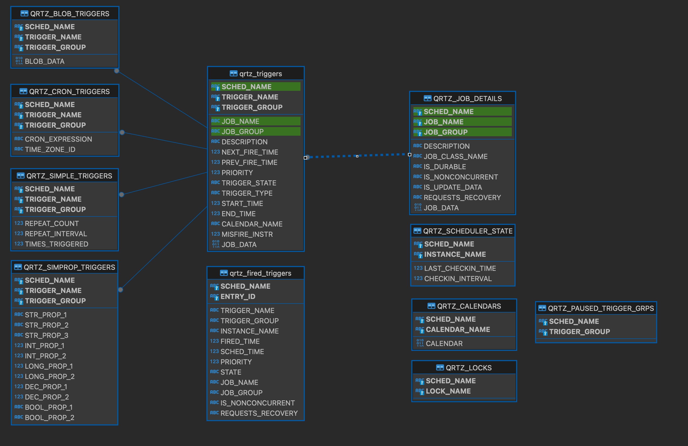

# Spring Quartz Scheduler And Micrometer Observation configuration.

## Mariadb Docker on Mac:

    $ docker images
    $ docker run --detach --name mariadb-quartz -v '<<Path>>/4.MountsAndVolumes/mariadbcontainer:/var/lib/mysql:Z' --env MARIADB_USER=appuser --env MARIADB_PASSWORD=appsecret --env MARIADB_DATABASE=quartzdb --env MARIADB_ROOT_PASSWORD=rootpwd   -p 3307:3306 mariadb:latest
    $ docker ps

            CONTAINER ID   IMAGE            COMMAND                  CREATED         STATUS         PORTS      NAMES
            3efd5e903381   mariadb:latest   "docker-entrypoint.s…"   2 minutes ago   Up 2 minutes   3306/tcp   mariadb-quartz

            Find the IP address that has been assigned to the container:
            $ docker inspect -f '{{range .NetworkSettings.Networks}}{{.IPAddress}}{{end}}' mariadb-quartz
                  172.17.0.2
                  Ref: Connecting to MariaDB from Outside the Container
                        https://mariadb.com/kb/en/installing-and-using-mariadb-via-docker/
                  Change databasee connection property: 
                  allowPublicKeyRetrieval true 
            Now you will get an Error: 
                  (conn=10) Access denied for user 'root'@'localhost' (using password: YES)
            
            Follow the below steps to fix the above error just to run this 
            command: ALTER USER 'root'@'localhost' IDENTIFIED VIA mysql_native_password USING PASSWORD('rootpwd');
            $ docker exec -it 3efd5e903381 bash   (OR) docker exec -it mariadb-quartz bash
       
            (Container Shell)root@3efd5e903381:~# mariadb -u root -p 
                  Enter password: rootpwd
                  Welcome to the MariaDB monitor.  Commands end with ; or \g.
                  Your MariaDB connection id is 4
                  Server version: 11.1.2-MariaDB-1:11.1.2+maria~ubu2204 mariadb.org binary distribution
                  Copyright (c) 2000, 2018, Oracle, MariaDB Corporation Ab and others.
                  Type 'help;' or '\h' for help. Type '\c' to clear the current input statement.
                  MariaDB [(none)]> \s
                        --------------
                        mariadb from 11.1.2-MariaDB, client 15.2 for debian-linux-gnu (aarch64) using  EditLine wrapper

                        Connection id:		4
                        Current database:	
                        Current user:		root@localhost
                        SSL:			Not in use
                        Current pager:		stdout
                        Using outfile:		''
                        Using delimiter:	;
                        Server:			MariaDB
                        Server version:		11.1.2-MariaDB-1:11.1.2+maria~ubu2204 mariadb.org binary distribution
                        Protocol version:	10
                        Connection:		Localhost via UNIX socket
                        Server characterset:	utf8mb4
                        Db     characterset:	utf8mb4
                        Client characterset:	utf8mb3
                        Conn.  characterset:	utf8mb3
                        UNIX socket:		/run/mysqld/mysqld.sock
                        Uptime:			11 min 26 sec
                        Threads: 1  Questions: 4  Slow queries: 0  Opens: 17  Open tables: 10  Queries per second avg: 0.005
                        --------------
                        MariaDB [(none)]> 
                        MariaDB [(none)]> SELECT user,authentication_string,plugin,host FROM mysql.user;

                        +-------------+-------------------------------------------+-----------------------+-----------+
                        | User        | authentication_string                     | plugin                | Host      |
                        +-------------+-------------------------------------------+-----------------------+-----------+
                        | mariadb.sys |                                           | mysql_native_password | localhost |
                        | root        | *A7663C386E0231DEB41859368A584CDF1D355C29 | mysql_native_password | localhost |
                        | root        | *A7663C386E0231DEB41859368A584CDF1D355C29 | mysql_native_password | %         |
                        | healthcheck | *27A92F935CC867AD77463675B2A58DDFD7D093B2 | mysql_native_password | 127.0.0.1 |
                        | healthcheck | *27A92F935CC867AD77463675B2A58DDFD7D093B2 | mysql_native_password | ::1       |
                        | healthcheck | *27A92F935CC867AD77463675B2A58DDFD7D093B2 | mysql_native_password | localhost |
                        | appuser     | *EF64C19A25631C2B74F8D8CC9B58D05271DB854C | mysql_native_password | %         |
                        +-------------+-------------------------------------------+-----------------------+-----------+
                        7 rows in set (0.009 sec)

###  Now tried to connect from host using db client 'DBeaver' with  username: appuser 
    Got RSAKey Error And to fix this error, Enabled connection drive property to true:
    allowPublicKeyRetrieval true

### Next got the below error: 

    (conn=29) Access denied for user 'appuser'@'localhost' (using password: YES)
    changed localhost to 127.0.0.1 as well but no use.
    FIX: 
                Host port is 3307 ....  after  changing the host port in db client... its perfectly fine.
     Create a new admin user with all PRIVILEGES
                CREATE USER 'admin'@'%' IDENTIFIED BY 'password';
                GRANT ALL PRIVILEGES ON *.* TO 'admin'@'%' WITH GRANT OPTION;
                FLUSH PRIVILEGES;

ref: https://hub.docker.com/_/mariadb  & https://stackoverflow.com/questions/41645309/mysql-error-access-denied-for-user-rootlocalhost

##  Spring Boot Application Setup

## Quartz tables has to be created 
Run the following schema to create tables using liquibase:

    https://github.com/quartz-scheduler/quartz/blob/main/quartz/src/main/resources/org/quartz/impl/jdbcjobstore/tables_mysql_innodb.sql

